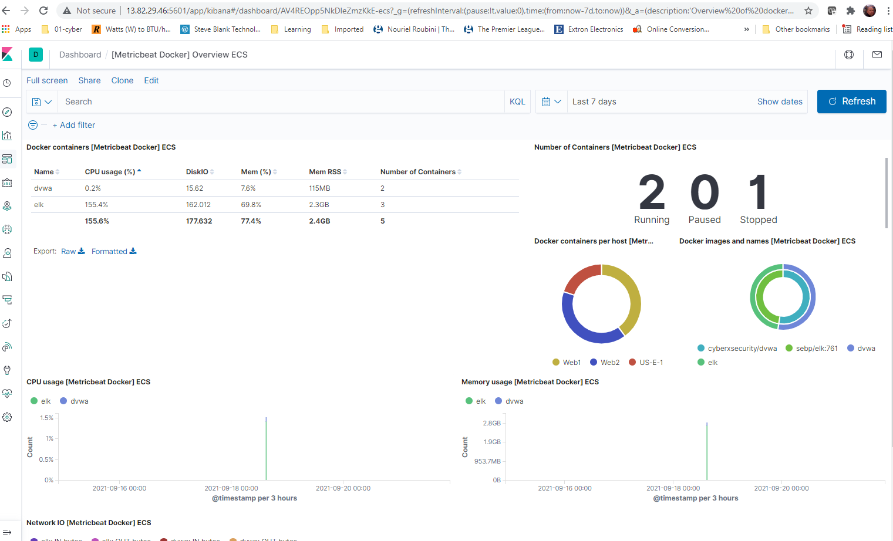

# public
cybersecurity public hub
Hello AI
## Automated ELK Stack Deployment

The files in this repository were used to configure the network depicted below.

These files have been tested and used to generate a live ELK deployment on Azure. They can be used to either recreate the entire deployment pictured above. Alternatively, select portions of the filebeat-playbook.yml.txt file may be used to install only certain pieces of it, such as Filebeat.

![ansible/filebeat-playbook.yml.txt] (https://github.com/see-bear/public/blob/main/ansible/filebeat-playbook.YML.txt)

This document contains the following details:
- Description of the Topology
- Access Policies
- ELK Configuration
  - Beats in Use
  - Machines Being Monitored
- How to Use the Ansible Build

### Description of the Topology

The main purpose of this network is to expose a load-balanced and monitored instance of DVWA, the D*mn Vulnerable Web Application.

Load balancing ensures that the application will be highly available, in addition to restricting the attack surface of the network.
- _TODO: What aspect of security do load balancers protect? What is the advantage of a jump box?_

Integrating an ELK server allows users to easily monitor the vulnerable VMs for changes to the files and system logs.
Filebeat monitors the log files or locations that you specify, collects log events, and forwards them either to Elasticsearch or Logstash for indexing.
Metricbeat takes the metrics and statistics that it collects and ships them to the output that you specify, such as Elasticsearch or Logstash.

The configuration details of each machine may be found below.
_Note: Use the [Markdown Table Generator](http://www.tablesgenerator.com/markdown_tables) to add/remove values from the table_.

| Jump-Box-Provisioner | Gateway        | 10.0.0.4 /52.242.18.55   | Linux |   |
|----------------------|----------------|--------------------------|-------|---|
| Web1                 | Web Server     | 10.0.0.5                 | Linux |   |
| Web2                 | Web Server     | 10.0.0.6                 | Linux |   |
| ELK                  | ELK Server     | 10.1.0.4 /52.138.103.192 | Linux |   |
| Load Balancer        | Load Balancer  | Static External IP       | Linux |   |
| Workstation          | Access Control | External IP or PublicIP  | Linux |   |

### Access Policies

The machines on the internal network are not exposed to the public Internet. 

Only the jump box machine can accept connections from the Internet. Access to this machine is only allowed from the following IP addresses:
Jump box address:20.151.234.123
Load balancer (web servers): 20.104.74.97

Machines within the network can only be accessed by the jumphost from a container
Jumphost container also provisioned the ELK VM using ansible. This is via the peering arrangement between the web VM virtual LAN and the ELK host virtual LAN.

A summary of the access policies in place can be found in the table below.

| Name     | Publicly Accessible | Allowed IP Addresses |
|----------|---------------------|----------------------|
| Jump Box | Yes                 | 20.151.234.123       |
| ELK host | Yes                 | 13.82.29.46          |
| LB       | YES                 | 20.104.74.97         |

### Elk Configuration

Ansible was used to automate configuration of the ELK machine. No configuration was performed manually, which is advantageous because...
We used a script that automated all of the tasks associated with installing the container and apps, and configuring the aps

The playbook implements the following tasks:
- _TODO: In 3-5 bullets, explain the steps of the ELK installation play. E.g., install Docker; download image; etc._
- ...Install docker, containers, filebeat, and metricbeat on the group: "Servers"
- ...Install pythion3
- ...Install docker module
- ...Increase memory size
- ...Download and install container; set ports and mapping of ports
- Screenshot of the list of tasks in the YML file:(https://github.com/see-bear/public/blob/main/ansible/filebeal-YML.png)

The following screenshot displays the result of running `docker ps` after successfully configuring the ELK instance.

### Target Machines & Beats
This ELK server is configured to monitor the following machines:
- _Web1: 10.0.1.12
- _Web2: 10.0.1.11

We have installed the following Beats on these machines:
- _Filebeat
- _Metricbeat

These Beats allow us to collect the following information from each machine:
- _TODO: In 1-2 sentences, explain what kind of data each beat collects, and provide 1 example of what you expect to see. E.g., `Winlogbeat` collects Windows logs, which we use to track user logon events, etc._
_In Kibana the Metricbeat dashboard shows the CPU use, memory use, and docker instance information
_In Kibana the filebeat dashboard shows log events organized into graphs that show usage per VM, and per running service
### Using the Playbook
In order to use the playbook, you will need to have an Ansible control node already configured. Assuming you have such a control node provisioned: 

SSH into the control node and follow the steps below:
- Copy the config yml file to the container on the jumpbox. This is the YML file:(https://github.com/see-bear/public/blob/main/ansible/filebeat-playbook.YML.txt)
- Update the playbook file to include the filebeat and metricbeat info and where to look (the config file) for the group of servers to update: (https://github.com/see-bear/public/blob/main/ansible/metricbeat-config.YML.txt)
- Run the playbook, and navigate to the ELK host to check that the installation worked as expected.
- Test Kibana on web : http://13.82.29.46:5601/app/kibana

